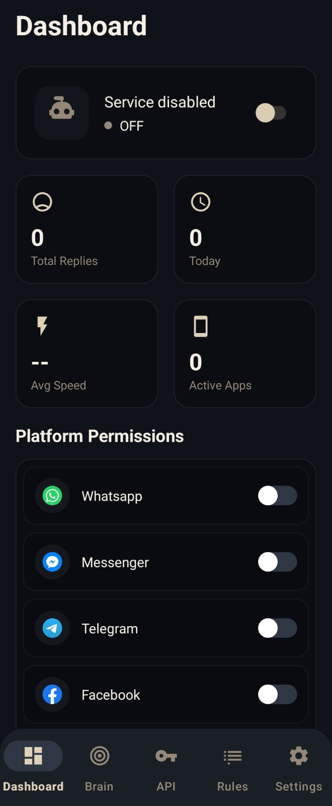

<!-- Logo -->

  
  <h1>AI AutoResponder</h1>
  
🤖 Smart AI-powered auto-reply app for WhatsApp, Messenger, Telegram, Instagram & Facebook

---

## ✨ Features

### 🔔 Smart Notification Listening
- Automatically detects incoming messages from multiple platforms
- Works in the background without interrupting you

### 🤖 AI-Powered Responses
- Context-aware AI generates natural replies
- Multiple persona options: Professional, Friendly, Witty, Minimal
- Learns from your conversation style

### 📱 Multi-Platform Support
- WhatsApp
- Messenger
- Telegram
- Instagram
- Facebook

### ⚡ Quick Reply Rules
- Create custom auto-reply rules
- Set specific triggers and responses
- Quick replies for common messages

### 🧠 Brain (Knowledge Base)
- Add personal information about yourself
- AI uses this context for accurate replies
- Your name, job, business details, and more

### 📊 Analytics Dashboard
- Track sent messages
- View response statistics
- Monitor AI performance

---

## 📸 Screenshots

  
  
  

---

## 📥 Download

### Latest APK
Download the latest release from the [Releases](https://github.com/Abir7109/AI-auto-responder/releases) page.

### Installation
1. Download the APK file
2. Enable "Install from unknown sources" in settings
3. Grant required permissions (Accessibility, Notification access)
4. Configure your AI settings and start chatting!

---

## 🔧 Configuration

### AI API Setup
The app uses Groq's Llama 3.1 model for AI responses. You can use the built-in free API or configure your own:

1. Go to **Settings → AI API**
2. Enter your Groq API key (or use the default)
3. Select your preferred AI persona

### Required Permissions
- **Accessibility Service** - To read and reply to messages
- **Notification Access** - To detect incoming messages
- **Storage Access** - For backup/restore (optional)

---

## 🛠️ Tech Stack

- **Language**: Kotlin
- **Min SDK**: 26 (Android 8.0)
- **Target SDK**: 34 (Android 14)
- **Architecture**: MVVM + Clean Architecture
- **Database**: Room
- **AI**: Groq Llama 3.1
- **UI**: Material Design 3

---

## 🤝 Contributing

Contributions are welcome! Please feel free to submit a Pull Request.

1. Fork the repository
2. Create your feature branch (`git checkout -b feature/AmazingFeature`)
3. Commit your changes (`git commit -m 'Add some AmazingFeature'`)
4. Push to the branch (`git push origin feature/AmazingFeature`)
5. Open a Pull Request

---

## 📄 License

This project is licensed under the MIT License - see the [LICENSE](LICENSE) file for details.

---

## 👨‍💻 Developer

**RM Abir**
- GitHub: [@Abir7109](https://github.com/Abir7109)
- Twitter: [@Abir7109](https://x.com/Abir7109)
- Instagram: [@Abir7109](https://instagram.com/Abir7109)

---

## ⭐ Show Your Support

If you found this project useful, please give it a ⭐️ and share it with others!

---

  
Made with ❤️ by RM Abir

